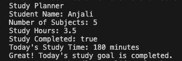
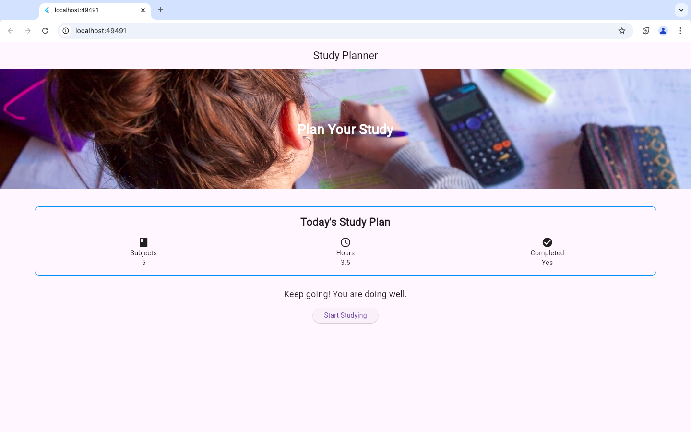
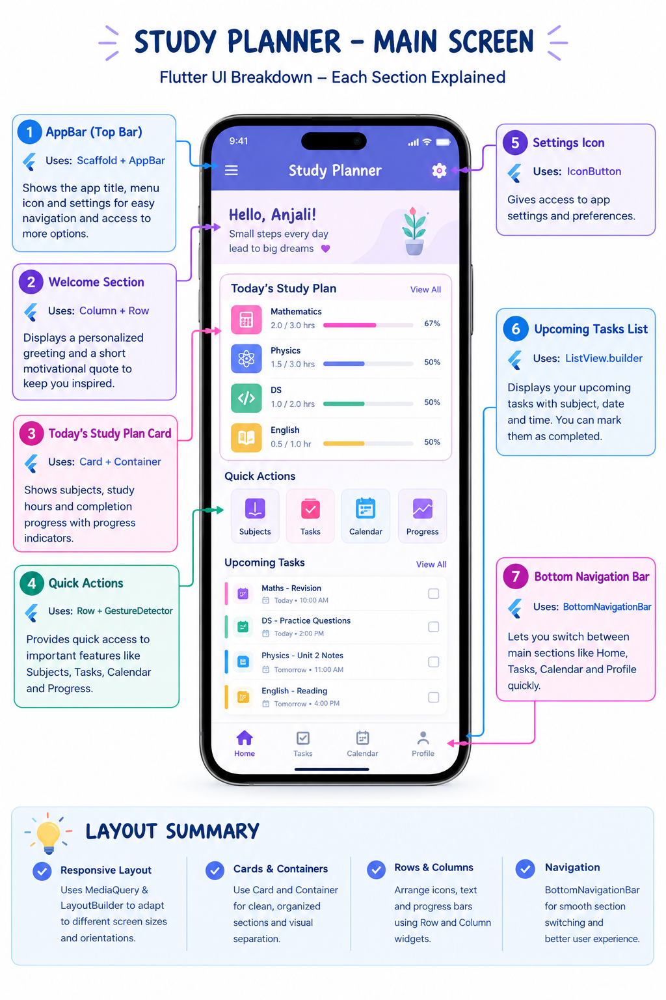

# Study Planner

## Abstract

The Study Planner is a Flutter-based mobile application developed to help students organize and manage their daily study activities in a simple and structured way. The application provides an easy-to-use interface for displaying study-related information such as subjects, study hours, and daily study plans.

The project is developed step by step by implementing different Flutter concepts through experiments. It includes Flutter and Dart basics, different widgets and layouts, images, and responsive user interface design. The application is designed to provide a clear and organized layout and can adapt to different screen sizes.

This project helps in understanding the practical implementation of Flutter concepts while developing a useful application for students. The Study Planner can be further improved in the future by adding features such as task management, reminders, progress tracking, and personalized study schedules.

---

## Experiment 1 – Flutter and Dart Basics

In this experiment, I created the basic Study Planner project and worked with some basic Dart concepts.

## Experiment 1 Output

---

## Experiment 2 – Flutter Widgets and Layouts

In this experiment, I extended the Study Planner by adding different Flutter widgets and arranging them to make the screen more organized.

I used Text, an image, icons, Container, and an ElevatedButton.

For arranging the elements, I used Column, Row, and Stack.

## Experiment 2 Output

---

## Experiment 3 – Design a Responsive User Interface Using MediaQuery and LayoutBuilder

In this experiment, I improved the Study Planner application by making the user interface responsive for different screen sizes.

I used MediaQuery to get the screen width, screen height, and device orientation. This helps the application adjust some UI elements according to the available screen size.

I used LayoutBuilder to check the available width and create different layouts for mobile and larger screens. I also used Expanded to divide the available space between widgets and avoid layout overflow.

The application can also detect whether the device is in Portrait Mode or Landscape Mode. By using these responsive widgets and techniques, the Study Planner interface can adapt better to different devices and screen sizes.

## Experiment 3 Output

---

## Current Application

The following screenshot shows the current stage of the Study Planner application after completing Experiment 3.

---

## Expected Final Application

The following sample image shows the expected design of the Study Planner application after completing the planned features.

---

## Future Enhancements

- Add and manage study tasks
- Add subjects and study schedules
- Add calendar-based planning
- Add study progress tracking
- Add reminders and notifications
- Improve the user interface