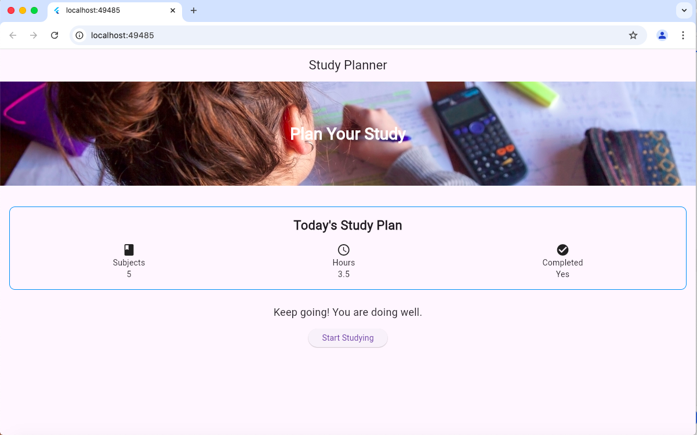

## Experiment 2 – Flutter Widgets and Layouts

In this experiment, I extended the Study Planner by adding different Flutter widgets and arranging them to make the screen more organized.

I used Text to display the study information, an image for the study section, and icons for the different study details. I used Container to group the study plan information and an ElevatedButton for the Start Studying button.

For arranging the elements, I used Column to place the sections vertically, Row to display the study details side by side, and Stack to place the heading over the image.

## Experiment 2 Output

